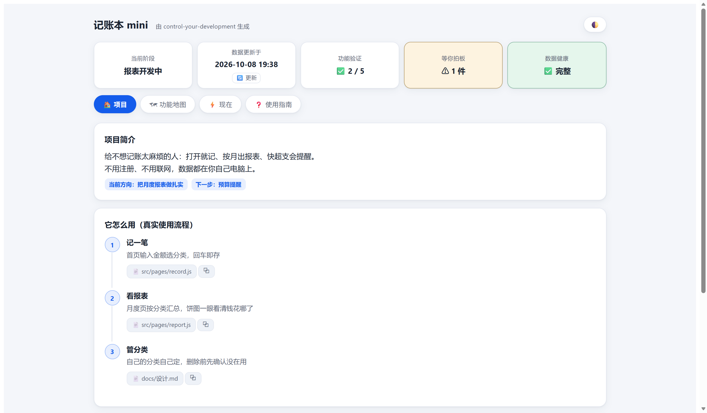
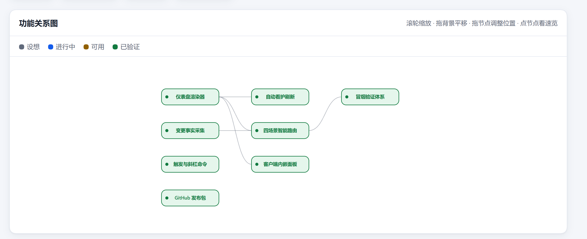
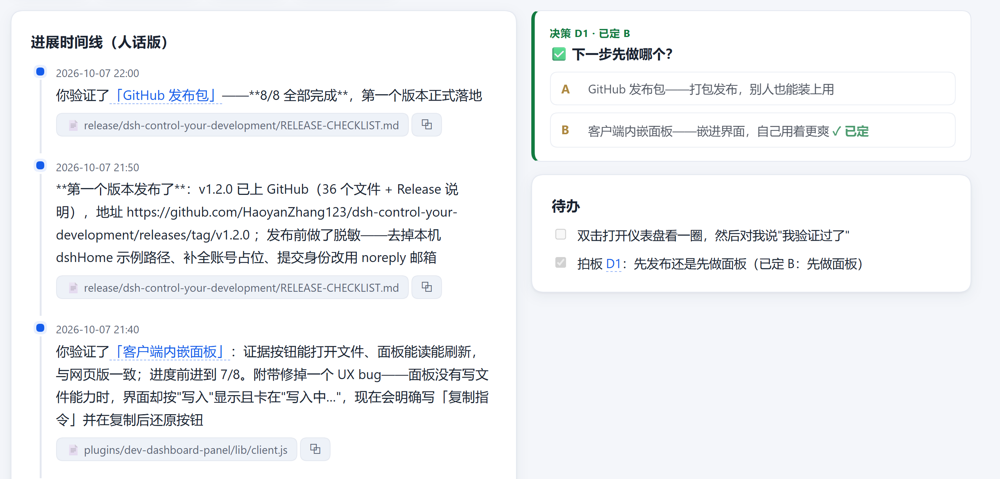
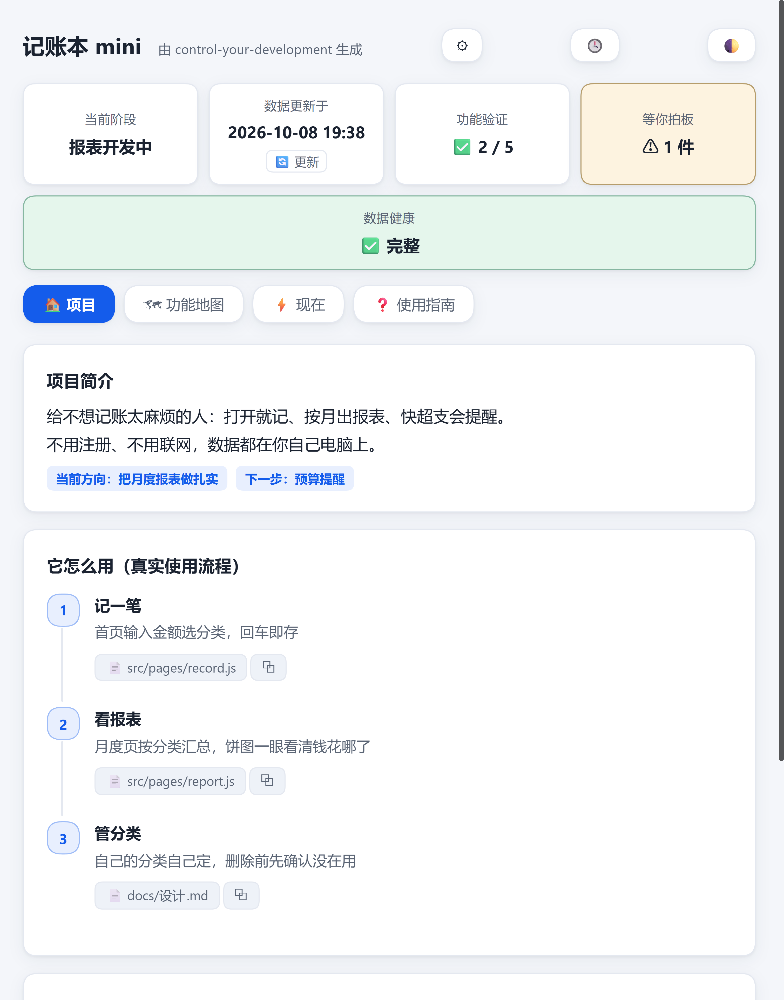

# dsh-plugin-control-your-development

> Turn the development process into a product dashboard you can actually read and control.
> Human-readable Markdown files are the single source of truth; the dashboard is pinned inside DSH (right sidebar + a full-page "Feature Map" tab on top of the conversation), and decisions you make on the panel go straight to the AI. Export a single-file offline web page only when you need to share.

Versions: skill v1.3.1 · panel plugin v0.5.2 | License: [MIT](LICENSE) | 语言：[中文](README.md)

---

## What is this

You're building a product with AI, but code, commit logs and terminals are not your language. **control-your-development** translates "how far along is development" into a product-level dashboard:

- What the product does and where it's heading — one page, plain words;
- Where every feature stands, with a progress bar that counts only features **you have personally verified**; large features can be split into **sub-items**, collapsed by default on the map and expanded on click;
- What changed recently and what decisions are **waiting for you** — open it and know, and **one click on an option sends it straight to the AI**, no copy-paste;
- No wording drift in long projects: an optional **glossary** standardizes names, and aliases written into the body raise a "terminology drift" warning in data health.

It is a DSH skill (teaches the AI to maintain your dashboard) plus a DSH panel plugin (right sidebar, plus a full-page "Feature Map" tab on top of the conversation). Want an offline web page you can send to others? Just say "export the web version".

## 30-second quick start

Prerequisite: DSH desktop is installed.

1. **Install the plugin (one step — it also installs the bundled skill)**: DSH → Plugins → Add plugin → enter:

   ```
   dsh-plugin-control-your-development
   ```

   This installs from the npm registry (a local mirror is used automatically in China — no GitHub access needed). On activation the plugin installs the skill it ships into the **global skills directory** (`<dshHome>/skills/`) — available in **every workspace**, no manual copying.

   > **Verified on real machines: macOS and Windows.** If npm is unreachable, use the offline `.tgz` attached to the Release (Add plugin → absolute path of the file).

2. Open your project in DSH and say to the AI: **"control my development"** (or "set up a development dashboard for me").

3. The AI creates `dev-dashboard/`; the right sidebar panel automatically shows the dashboard of **the workspace you have open** — switch projects and it follows (for a workspace without a dashboard, the panel gives you a "send" button — one click asks the AI to set it up).

> Prefer no plugin? Copy `skill/control-your-development/` into your project's `.dsh/skills/` (create the `.dsh\skills` directory first, or PowerShell treats the whole path as the new directory name and flattens the skill into the wrong place).

For full installation options (global install, panel plugin, uninstall & upgrade), see [INSTALL.md](INSTALL.md).

## Take a look

**Dashboard · Project home** — one-line positioning, current direction, the control strip.


**Feature Map** — five-state cards (Idea / In Progress / Usable / Verified / Deprecated) + dependency graph.


**Now** — the timeline and the decision cards waiting for your call.


**Embedded panel** in the DSH right sidebar (next to Files / Terminal / Browser, title carries the project name).


## Highlights

**Human-readable files, one job each**
- `PRODUCT.md`: the front door — what this is, who it's for, where it's heading;
- `FEATURES.md`: status — where every feature stands, with evidence and dependencies; large features can be split into **sub-items** (collapsed into a badge on the map, expanded on click);
- `NOW.md`: the pulse — what happened lately, what's waiting for your decision;
- `GLOSSARY.md` (optional): the glossary — the single naming standard across the project; aliases in the body raise a "terminology drift" warning in data health.

**Progress defined by you (state machine)**
Every feature moves along Idea → In Progress → Usable → Verified. The AI may mark a feature "Usable" at most; "Verified" happens only when you say so — and the progress bar counts verified features only. States can also move back: revoking a verification returns to Usable (nothing broke — the stamp is just withdrawn), rework returns to In Progress, deprecation moves to Deprecated, and a deprecated feature can be restored to Idea. Every rollback gets a line in the timeline.

**Two-way loop: decisions on the panel go straight to the AI**
In the decision center, pick an option, add a note, and click "📤 Send decision" — it goes straight into the current conversation; the "Start this / Rework / Deprecate" buttons on feature details work the same way. If the AI isn't online, the message is first recorded into `dev-dashboard/.inbox.jsonl` and picked up automatically on the next update — nothing gets lost. Every decision you make is recorded in the timeline, and a **version snapshot** is saved automatically (the 🕓 button lets you look back and compare with the current state anytime).

**Full-page "Feature Map" tab**
At the top of the conversation page, alongside "Chat / Trajectory": view the feature relationship graph at full-page width, with wheel zoom, drag-to-pan and one-click fit-to-screen; node width adapts to the name, long names wrap and truncate with the full text on hover; file paths are truncated in the middle with the full path on hover.

**Single-file offline web page (optional export)**
Want to show a partner or client? Say "export the web version": a single `index.html` — zero dependencies, zero network, light/dark adaptive, print-friendly.

**Honesty mechanism — omissions raise alarms**
- Every code change must be either incorporated into the dashboard or explicitly ignored — **silent omission is not allowed**;
- Missing evidence files or unfiled facts make the render step fail loudly, instead of shipping a dashboard that "looks fine";
- Every feature description must cite files that actually exist; fabrication is not possible.

## Installation

| What | Fastest path |
|---|---|
| **Plugin + skill (recommended, one step)** | DSH → Plugins → Add plugin → enter `dsh-plugin-control-your-development` (npm package name; a mirror is used in China). The plugin installs the bundled skill globally |
| Skill only (no panel) | Copy `skill/control-your-development/` into your project's `.dsh/skills/` |
| Offline install (npm unreachable) | Download the `.tgz` from the Release assets and enter its **absolute path** in Add plugin |
| ⚠️ Not recommended: pasting a GitHub URL | Requires git installed locally and GitHub access — often fails in China; use the npm package name instead |

Full options (global install, offline install, uninstall & upgrade): [INSTALL.md](INSTALL.md)

## Daily use

Once installed, drive it in plain language inside DSH:

| You say | The AI does |
|---|---|
| "control my development" / "set up the dashboard" | Initializes dev-dashboard |
| "This phase is done — update the dashboard" | Collects changes, updates the Markdown files, re-renders (the panel refreshes instantly) |
| Click "📤 Send decision" on the panel, or say "Decision D1: A and C" | Records your call, saves a version snapshot, continues development |
| "I've verified the expense logging feature" (or "✅ I verified this" on the details page) | Marks the feature Verified; the progress bar moves |
| "Save a version" | Saves the current Markdown as a version snapshot you can compare anytime |
| "Export the web version" | Generates a single-file `index.html` — double-click to open, ready to share |

You never edit the dashboard itself by hand — it is a machine artifact, always regenerated from the Markdown source of truth.

## What's in the repo

```
dsh-plugin-control-your-development/
├─ package.json / cordis.patch.yml   ← panel manifest (repo root IS the plugin package)
├─ lib/ src/ tools/                  ← panel: browser bundle / source / build script
├─ PLUGIN.md                         ← panel notes and development gotchas
└─ skill/
   └─ control-your-development/      ← the capability itself
      ├─ SKILL.md / manifest.yaml    ← skill definition
      ├─ static/                     ← the AI's working discipline and workflow
      ├─ templates/                  ← three-file templates + page templates
      ├─ scripts/                    ← render / collect / watch (pure Python stdlib)
      └─ references/                 ← data format specification
```

## FAQ

**Add plugin fails with `'git' is not recognized` or `git ls-remote ... failed`?**
That means you pasted the **GitHub URL** — installing a git URL requires git on the machine (absent by default on Windows/macOS) and GitHub access.
**Enter the npm package name instead** — no git, no GitHub:

```
dsh-plugin-control-your-development
```

**What do I need?**
DSH desktop. Rendering uses the Python bundled with DSH: standard library only, nothing to install, no network needed.

**Will it touch my code?**
No. It only reads change records; everything it writes stays inside the `dev-dashboard/` directory.

**Does it work without git?**
Yes. With git it collects changes via git; without git it falls back to file-modification-time scanning and labels the source on the page.

**Does the dashboard update itself?**
Yes, with one caveat. The AI re-renders immediately every time it edits the Markdown files ("edit, then render"), and the panel refreshes right away — so as long as you keep working in the conversation you always see the latest. At init it also starts a background watcher (`watch_dashboard.py`): while that process is alive, any Markdown change re-renders automatically. When the watcher stops (conversation over, background task reclaimed, machine restarted) the dashboard won't change on its own — just tell the AI "update the dashboard".

**What changed in v1.3?**
① Features can be split into `### Sub-items:` (collapsed by default on the map, expanded on click); ② new optional `GLOSSARY.md` glossary with terminology-drift warnings; ③ decision/action buttons on the panel upgraded from "copy instructions" to "send directly" (recorded into `.inbox.jsonl` as a fallback when the AI isn't online); ④ a new full-page "Feature Map" tab on top of the conversation page; ⑤ a version snapshot is saved automatically when a decision lands; ⑥ `index.html` went from "always generated" to "optional export" — an existing one stays updated, a missing one is no longer created; say "export the web version" when you want to share.

**Can I edit `index.html` directly?**
No — it's a machine artifact (an optional export), and hand edits get overwritten on the next generation. To change content, edit the Markdown files — usually you just tell the AI in conversation.

**Is the panel plugin required?**
No. The skill alone maintains the dashboard (the offline web page can still be exported); the panel saves you a window switch and the copy-paste when making decisions.

**The web page's "🔄 Update" errors, or clicking it does nothing?**
The web version reads and writes `dev-dashboard/` in your project, which requires you to **grant folder access**: the browser shows one permission prompt — choose the **project root containing `dev-dashboard/`**. The browser remembers it afterwards. The right sidebar panel needs no such grant — it reads through DSH's own interface.

**How do I update to a new version?**
Plugin: DSH → Plugins → Uninstall, then Add plugin with `dsh-plugin-control-your-development` (you can also pin a version, e.g. `dsh-plugin-control-your-development@0.5.2`); afterwards **refresh the page (Ctrl+R) or restart DSH**. Skill: updates automatically with the plugin; if you installed it manually, copy the folder again.

**macOS / Linux?**
Yes for macOS: **verified on real machines, both macOS and Windows** (web page + right sidebar panel). Linux is not verified on a real machine, but the scripts use cross-platform APIs only and paths are written portably.

## License & contributing

[MIT](LICENSE) © 2026 dsh-plugin-control-your-development contributors.
Questions and suggestions via GitHub Issues; maintainer release flow in [RELEASE-CHECKLIST.md](RELEASE-CHECKLIST.md).
